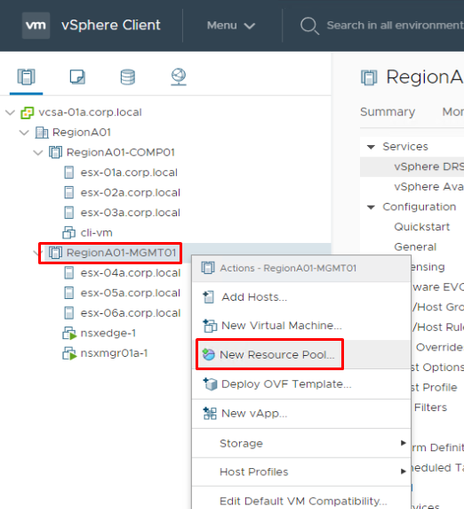
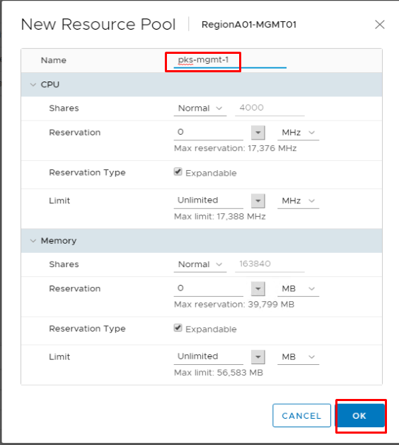
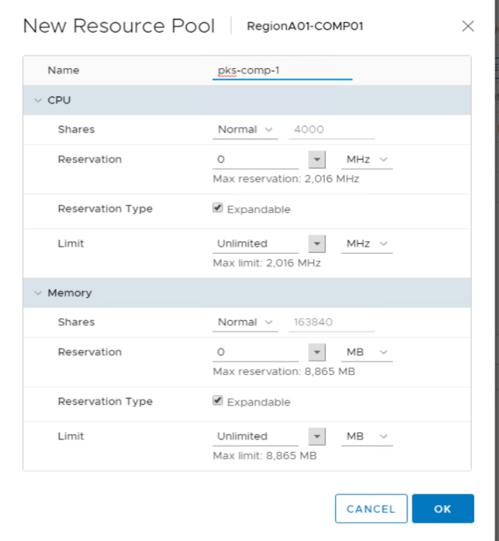
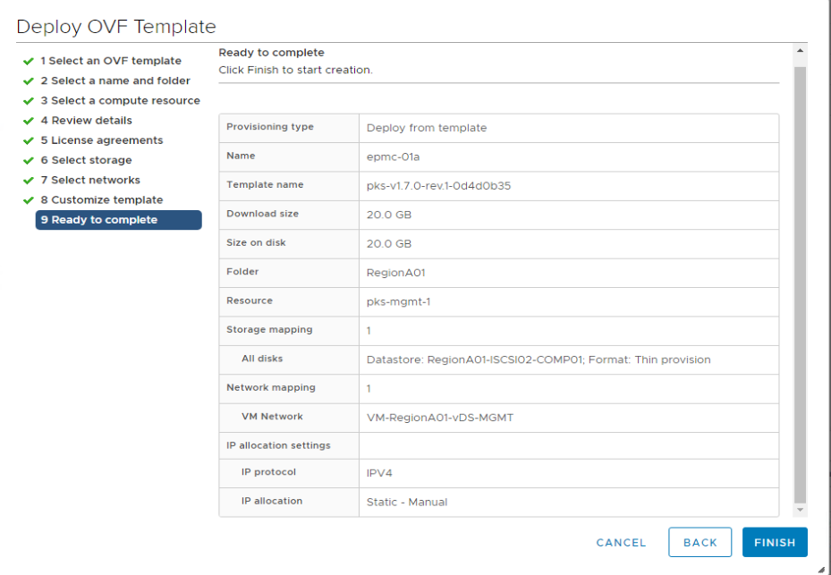
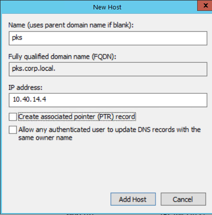
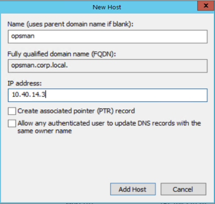
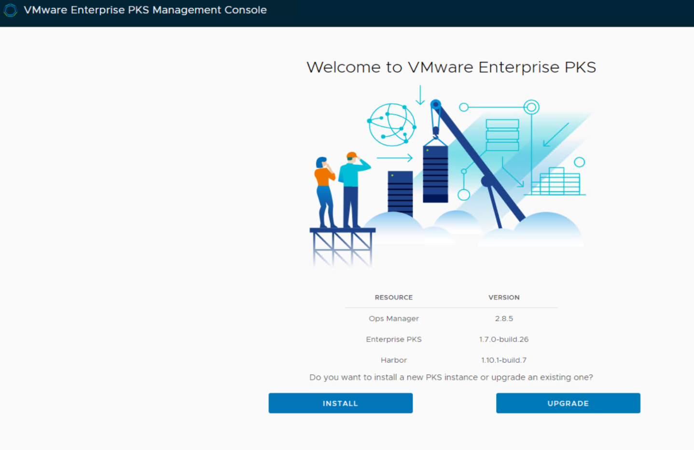
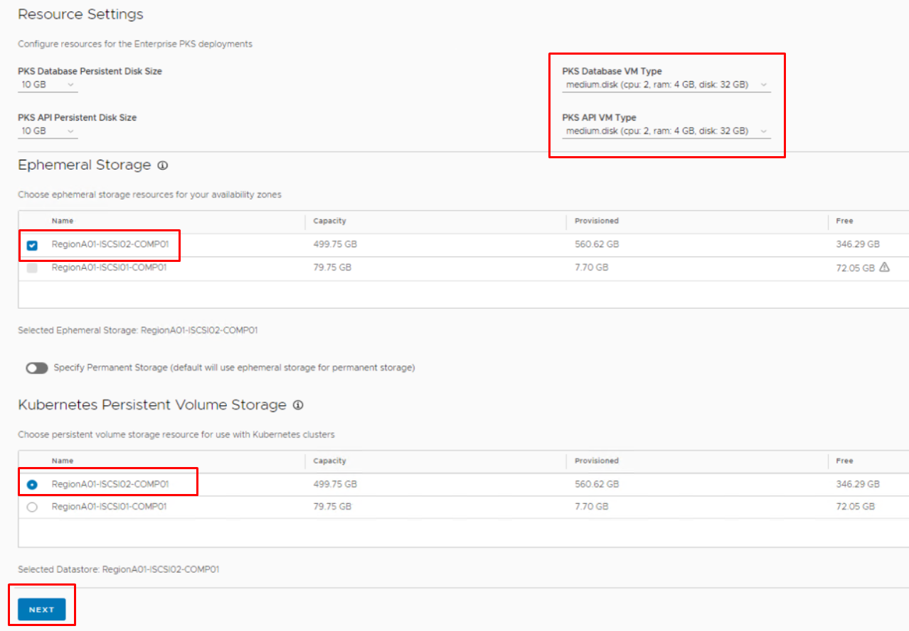
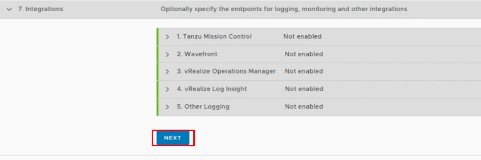
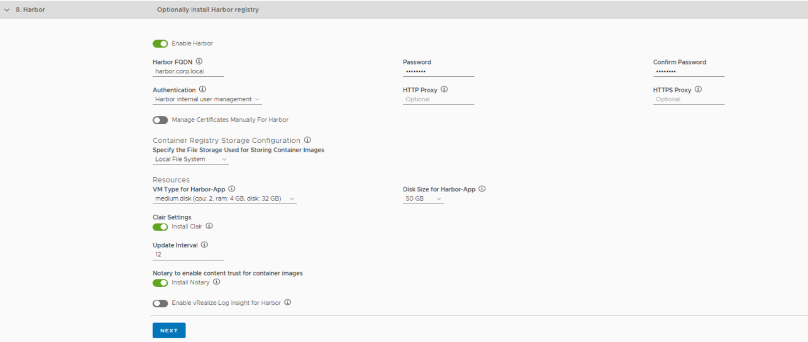

# Tanzu Kubernetes Grid Integrated edition (Formerly Enterprise PKS) Installation with the TKGI Management Console

**Table of Contents**

- [Tanzu Kubernetes Grid Integrated edition (Formerly Enterprise PKS) Installation with the TKGI Management Console](#tanzu-kubernetes-grid-integrated-edition-formerly-enterprise-pks-installation-with-the-tkgi-management-console)
  - [Prerequisites](#prerequisites)
  - [Install TKGI 1.7 with TKGI Management Console (EPMC)](#install-tkgi-16-with-tkgi-management-console-epmc)
    - [Step 0: Download EPMC OVF File](#step-0-download-epmc-ovf-file)
    - [Step 1: Create resource pools for the TKGI Management & Compute Plane virtual machines](#step-1-create-resource-pools-for-the-tkgi-management--compute-plane-virtual-machines)
    - [Step 2: Deploy the EPMC OVF File](#step-2-deploy-the-epmc-ovf-file)
    - [Step 3: Complete the installation workflow](#step-3-complete-the-installation-workflow)

## Prerequisites

This lab guide is designed for the TKGI-Ninja-Baseline Template. You must complete the [NSX-T 2.5.1 Manual Install Lab Guide](https://github.com/ModernAppsNinja/Nsxt2-5-1ManualInstall_NM4894)

## Install TKGI 1.7 with TKGI Management Console (EPMC)

Please be sure to complete the requirements in the [Prerequisites](#prerequisites) section above before proceeding.

### Step 0: Download TKGI Management Console OVF File

#### Users of this lab will need to use their own access to download the files for EPMC. Please download the EPMC OVA file to control center before proceeding.

### Step 1: Create resource pools for the TKGI Management & Compute Plane virtual machines

#### 1.1 From the ControlCenter desktop, open chrome, connect to the vSPhere web client and login using the windows system credentials checkbox. Navigate to the `Hosts and Clusters` page, expand `RegionA01`, right click on `RegionA01-MGMT01` and select `New Resource Pool`

Screenshot 1.1

#### 1.2 Name the resource pool `tkgi-mgmt-1`, leave all other values to default and click `OK` to create the resource pool

Screenshot 1.2

#### 1.3 Navigate to the `Hosts and Clusters` page, expand `RegionA01`, right click on `RegionA01-COMP01` and select `New Resource Pool`

Screenshot 1.3

#### 1.4 Name the resource pool `tkgi-comp-1`, leave all other values to default and click `OK` to create the resource pool

Screenshot 1.4

### Step 2: Deploy the TKGI-MC OVF File

#### 2.1  Navigate to the `Hosts and Clusters` page, expand `RegionA01`, right click on the resource pool `tkgi-mgmt-1` and select `Deploy OVF Template`

Screenshot 2.1

#### 2.2  Select the EPMC OVF File from the location where you downloaded it and click `Next`. The default download location is `E:\Downloads`.

Screenshot 2.2

#### 2.3 On the `Select Name and Folder` page, set the `Virtual Machine Name` to `tkgi-mc-01a` and click `Next`

Screenshot 2.3

#### 2.4 On the `Select a compute resource` page, expand `RegionA01-MGMT01` and select the `tkgi-mgmt-1` resource pool and click `Next`.

Screenshot 2.4

#### 2.5 On the `Review Details` page, verify the details and click `Next`.

Screenshot 2.5

#### 2.6 On the `License Agreements` page, check the `I accept all license agreements` checkbox and click `Next`.

Screenshot 2.6

#### 2.7 On the `Select Storage` page, **First** select the `RegionA01-ISCSI02-COMP01` datastore, and then set the `virtual disk format` to `Thin Provision` and click `Next`.

Screenshot 2.7

#### 2.8 On the `Select networks` page, set the `VM Network` to `VM-RegionA01-vDS-MGMT` and click `Next`.

Screenshot 2.8

#### 2.9 On the `Customize template` page, enter the following values: (leave any unspecified values to their default setting)

- Root Password: `VMware1!`
- Permit Root Login: `True`
- Network IP Address: `192.168.110.28`
- Network Netmask: `255.255.255.0`
- Default Gateway: `192.168.110.1`
- Domain Name Servers: `192.168.110.10`
- Domain Search Path: `corp.local`
- FQDN: `tkgi-mc-01a.corp.local`
- Click `Next`

Screenshot 2.9

#### 2.10 On the `Ready to complete` page, review the details and click `Finish`

Screenshot 2.10

#### 2.11 On the Control Center desktop, click the windows start key and search for `DNS`, select the top result shown as shown in the following screenshot. 

Screenshot 2.11

#### 2.12 In `DNS Manager` expand `Forward Lookup Zones` and left-click `corp.local` Right click the `corp.local` folder, and select `New Host (A or AAAA)...`

Screenshot 2.12

#### 2.13 In the `New Host` dialogue enter the following values:

- Name: `tkgi-mc-01a`
- IP Address: `192.168.110.28`
- Click `Add Host`

Screenshot 2.13

#### 2.14 In the `New Host` dialogue enter the following values:

- Name: `tkgi`
- IP Address: `10.40.14.4`
- Uncheck (False) `Create associated pinter record`
- Click `Add Host`

Screenshot 2.14

#### 2.15 In the `New Host` dialogue enter the following values:

- Name: `opsman`
- IP Address: `10.40.14.3`
- Uncheck (False) `Create associated pinter record`
- Click `Add Host`

Screenshot 2.15

#### 2.16 In the `New Host` dialogue enter the following values:

- Name: `harbor`
- IP Address: `10.40.14.5`
- Uncheck (False) `Create associated pinter record`
- Click `Add Host`
- Close DNS Manager

Screenshot 2.16

#### 2.17 Return to the vSphere web client, expand `Recent Tasks` and verify that the epmc ovf package import is complete. If your OVF Package import is not yet completed, please wait until it completes before proceeding.

Screenshot 2.17

#### 2.18 From the `Hosts and Clusters` page, navigate to and expand the `RegionA01-MGMT01 > pks-mgmt-01` resource pool, right click `epmc-01a` and select `Power > Power On`. 

Screenshot 2.18

### Step 3: Complete the installation workflow

#### 3.1 From the Control Center Desktop, open a new browser tab in chrome, and navigate to [https://tkgi-mc-01a.corp.local/login](https://tkgi-mc-01a.corp.local/login), login with the username `root` and the password `VMware1!`, click `INSTALL`, and then click `START CONFIGURATION`

Screenshot 3.1.1

Screenshot 3.1.2

#### 3.2 In the `PKS Configuration` Dialogue, enter the following values in section `1. vCenter Account`(leave any unspecified values set to their default value):

- vCenter Server: `vcsa-01a.corp.local`
- Username: `administrator@corp.local`
- Password: `VMware1!`
- Click the `Connect` button
- DataCenter: `RegionA01`
- Click `Next`

Screenshot 3.2

#### 3.3 Enter the following values in section `2. Networking`(leave any unspecified values set to their defaults):

- Container Networking Interface:
  - Select `NSX-T Data Center (Automated NAT Deployment)`
- NSX Manager Details:
  - NSX Manager: `192.168.110.42`
  - Username: `admin`
  - Password: `VMware1!VMware1!`
  - Click `Connect`
- Uplink Network:
  - Uplink CIDR: `192.168.210.0/24`
  - Gateway IP: `192.168.210.1`
  - VLAN ID: `0`
  - T0 Uplink 1 IP: `192.168.210.3`
- Network Resources:
  - Deployment CIDR: `172.31.0.0/24`
  - Deployment DNS: `192.168.110.10`
  - NTP Server: `192.168.100.1`
  - Pod IP Block CIDR: `172.15.0.0/16`
  - Node IP Block CIDR: `172.16.0.0/16`
  - Nodes DNS: `192.168.110.10`
  - Usable Range of Floating IPs
    - From: `10.40.14.2`
    - To: `10.40.14.6`
    - Click `ADD RANGE` to add an additional range of floating IPS with the following values:
      - From: `10.40.14.34`
      - To: `10.40.14.62`
  - Disable SSL Certificates Verification: `True`
- Click `Next`

Note: If the `Next` box is greyed out after you have entered all the values, try clicking the refresh button to refresh the network connection to NSX manager.

Screenshot 3.3

#### 3.4 In the `3.Identity`section please enter the following values (leave any unspecified values set to their default value):

- Select `Local user database`
- PKS API FQDN: `tkgi.corp.local`
- Configure Created CLusters to Use UAA as the OIDC Provider: `True`

Screenshot 3.4

#### 3.5 Enter the following values in section `4. Availability Zones` (leave any unspecified values set to their default value):

- Under `Availability Zone`
  - Name: `TKGI-MGMT-1`
  - This is the management availability zone: `True`
  - Compute Resource: `tkgi-mgmt-1`
  - Click `Save Availability Zone`
- Click `Add Availability Zone`
  - Name: `TKGI-COMP`
  - Compute Resource: `tkgi-comp-1`
  - Click `Save Availability Zone`
- Click `Next`

Screenshot 3.5.1

Screenshot 3.5.2

#### 3.6 Enter the following values in section `5. Resources & Storage`(leave any unspecified values set to their default value):

- PKS Database VM Type:
  - `medium.disk (cpu:2, ram: 4 GB, disk: 32 GB)`
- PKS API VM Type:
  - `medium.disk (cpu:2, ram: 4 GB, disk: 32 GB)`
- Ephemeral Storage:
  - Select: `RegionA01-ISCI02-COMP01`
- Kubernetes Persistent Volume Storage:
  - Select: `RegionA01-ISCI02-COMP01`
- Click `Next`

Screenshot 3.6

#### 3.7 Enter the following values in section `6. Plans`(leave any unspecified values set to their default value):

- `Small`
  - Name: `Small`
  - Worker Node Instances: `2`
  - Worker Persistent Disk Size: `30 GB`
  - Enable Priviledged Containers: `True`
  - Click `Save Plan`
- `Medium`
  - To the right of `Save Plan`, click `DELETE` to delete the medium plan
- `Large`
  - To the right of `Save Plan`, click `DELETE` to delete the medium plan
- Click `Next`

Screenshot 3.7

#### 3.8 In the `PKS Configuration` Dialogue section `7. Integrations`, click `Next`

Screenshot 3.8

#### 3.9 Enter the following values in section `8. Harbor` (leave any unspecified values set to their default value):

- Enable Harbor: `True`
- Harbor FQDN: `harbor.corp.local`
- Password:   `VMware1!`
- Confirm Password: `VMware1!`
- VM type for harbor-app: `medium.disk (cpu: 2, ram: 4GB, disk: 32GB)`
- Disk size for harbor-app: `50 GB`
- Updater Interval: `12`
- Click `Next`

Screenshot 3.9

#### 3.10 Enter the following values in section `9. CEIP and Telemetry`(leave any unspecified values set to their default value):

- Please select your participation level in the CEIP and Telemetry Program: `None`
- Please select how you will be using this PKS Installation: `Demo or Proof-of-concept`
- Click `Next`
- Click `Generate Configuration`

Screenshot 3.10

#### 3.11 In the `PKS Configuration` Dialogue, on the `Configuration YAML` screen, review the values and observe that you could edit values with the in-browser text editor if you needed to. Click `APPLY CONFIGURATION`, and on the `Apply Configuration` popup window, select `Continue`

Screenshot 3.11.1

Screenshot 3.11.2

Screenshot 3.11.3

#### 3.12 Observe the various steps that the deployment goes through on the `Installing PKS Instance` screen while waiting for the deployment to complete:

Screenshot 3.12

#### 3.13 After the installation completes, click `Go To VMware TKGI`

Screenshot 3.13

#### 3.14 Observe the information provided, including links to the relevant VM and Network object pages in vCenter and NSX Manager, making it easy to identify and more effectively utlize vSphere tools when supporting the TKGI Deployment. 

If you look at the cluster and nodes tabs right now they are blank as you have not deployed a cluster yet. After you deploy a cluster revisit the clusters and nodes tabs to easily find exactly which VMs and vsphere/nsx objects are associated with each K8s cluster.

Screenshot 3.14

#### 3.15 Click on `Deployment Metadata` and observe that this tab provides each of the certificates and secrets used during the deployment, providing a simple, central location administrators can go to find access details.

Navigate to the 2nd page of the `Deployment Metadata` screen and observe the IP addresses for each of the VM's deployed by epmc.

Screenshot 3.15.1

Screenshot 3.15.2

#### 3.16 From Control Center, open DNS Manager and navigate to `corp.local` folder. Update the entries for `harbor`, `opsman` and `pks` to match the IP addresses you observed in the previous step.

Screenshot 3.16

#### 3.17 From Control Center, open a new chrome browser tab and click on the `Harbor` bookmark and login with the username `admin` and the password `VMware1!`

Screenshot 3.17.1

#### 3.18 To access the Ops Manager UI, from Control Center, get the Ops Manager IP address from [https:tkgi-mc.corp.local](https:tkgi-mc.corp.local) UI `Deployment Metadata->Ops Manager Address`, and also get the `Ops Manager Admin User Name` and `Ops Manager Admin User Password`.  Then, open a new chrome browser tab and load up the Ops Manager IP address and login with the username and password you retrieved.

Screenshot 3.18.1

Screenshot 3.18.2

Screenshot 3.18.3

#### 3.19 Return to the `epmc-01a` web console, navigate to the `Deployment Metadata` and find the `Enteprise PKS Admin User Name` and `Password` You will use this information in the next step to log into the TKGI API.

Screenshot 3.19

#### 3.20 From the control center desktop, open a putty session to `ubuntu@cli-vm` and from the prompt, enter the following command to login to the PKS API. Be sure to use the password you gathered in the previous step:

`pks login -a pks.corp.local -u admin -p ReplaceWithPassword -k` 

Screenshot 3.20

**End of lab**

